**<u>EEE LUNAR ROVER GROUP 10</u>**

<table>
<thead>
<tr>
<th>Group Members</th>
<th>Role</th>
</tr>
<tr>
<th>Mohammed Salem</th>
<th rowspan="2">Movement + User interface</th>
</tr>
<tr>
<th>Albert Ma</th>
</tr>
<tr>
<th>Devesh Kemani</th>
<th>Magnetism Detection</th>
</tr>
<tr>
<th>Christopher Koh</th>
<th>Project Manager + Infrared Detection</th>
</tr>
<tr>
<th>Wangmo Koo</th>
<th>Ultrasonic Detection + Parts IC</th>
</tr>
<tr>
<th>Ye Zifan</th>
<th>Age Detection</th>
</tr>
</thead>
<tbody>
</tbody>
</table>

**<u>TIMELINE</u>**

28 May - Interim Presentation

11 June - Report + Reflection Form

16 June - Demo

Components to order

| Item              | Cost (pounds) | Min quantity |
|-------------------|---------------|--------------|
| SS49E hall sensor | \<1           |              |
|                   |               |              |
|                   |               |              |
|                   |               |              |
|                   |               |              |
|                   |               |              |

Steering

Receiving signals:

- Radio (age)

- Infrared

- Ultrasonic

- Magnetic

Weight (max 750g)

HARDWARE

[<u>https://www.keysight.com/used/gb/en/knowledge/guides/voltage-regulators</u>](https://www.keysight.com/used/gb/en/knowledge/guides/voltage-regulators)

**Report writing tips**

- See teams document

- Ensure narrative flow of report

- 

**INTERIM PRESENTATION**

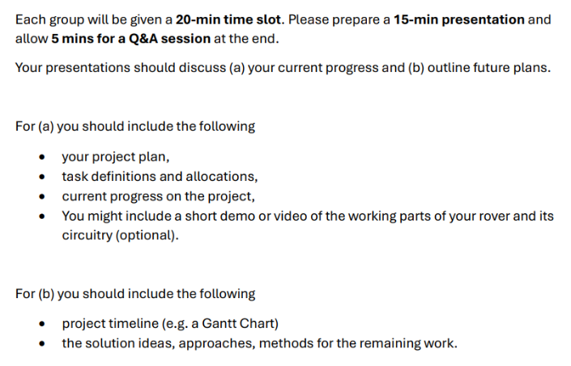

**MAGNETISM DETECTION (DEVESH)**

<u>Sensing magnetic fields</u>

Hardware: SS49E hall sensor

Pin 1 (VCC): Connect to 3.3V on your Metro board.

Pin 2 (GND): Connect to GND.

Pin 3 (Output): Connect to an analog pin, like A0.

Metro M0 converts the voltage into a number 0-1023 using the analogue to digital converter

When no magneti near by - supply voltage = 1.65ishV and analogRead() will return a value near 512.

As a North pole approaches, the voltage rises toward 3.3V value moves toward 1023

As south pole approaches, the voltage drops toward 0V (value moves toward 0).

Magnetic field strength is proportional to r^3 so might only detect small changes. If the signal is too weak use Opamp as a non-onverting amplifier. MCP6002 opamp and build on breadboard

**Get op amp working, in slides talk about challenges that voltage signal isnt strong enough and solution w op amp. Do research into how magnetic sensor works and background knowledge for Q and A. run basic code from laptop. Write future part (talk about mount).**

**2-4 inclusive slides are my part**

Measure is +vs or-ve depending on which face of the sensor the magnet goes on, if magnet south puth faces magnet at all times.

0-1.8 in reality (in specs its0.2-1.8)

since 1V is when there is no sensor, the digital reading is 310.

Op amp

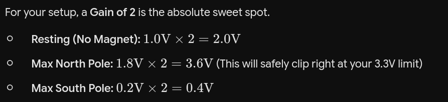

Need to be literally touching the magnetic for 1.8v reding anyways so gain of 2 works as we will knoe if its in our face regardless that 0.3 v range we lose is negligible

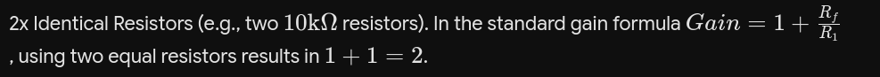

Sample code:

void setup() {

Serial.begin(9600);

}

void loop() {

int sensorValue = analogRead(A0);

// 512 is the middle. We add a buffer of +/- 50 to avoid noise.

if (sensorValue \> 560) {

Serial.println("Magnetic Field: UP (North)");

} else if (sensorValue \< 460) {

Serial.println("Magnetic Field: DOWN (South)");

} else {

Serial.println("No strong magnetic field detected.");

}

delay(200);

}

- The motors or whatever else may create a magnetic field o their own so in the setup we need to account for that and records that value - 0 it out.

- Need to also account for rolling average, eg if value rises from 510 to 512 it doesnt necessarily mean we are moving closer to a rock. Therefore we should use a rolling average (eg the value of the reading is the average of the last 4 ‘snapshots’). Can achieve this simply with an array

- Need to account for other rocks magnetism in the code but i dont know how strong the other rocks magnetism will be

- 

Positioning:

- Point face (side with writing) down and point forward (closest to rock)

- Positing furthest away from motors

- 3D print a mount that can connect to the pins

const int hallPin = A0;

// Rolling Average Configuration

const int numReadings = 8; // Size of the filter window. Higher = smoother but slightly slower response.

int readings\[numReadings\]; // Array to store the raw ADC snapshots

int readIndex = 0; // Current position in the array

long total = 0; // Running sum of the array

int average = 0; // The smoothed output

// Baseline Configuration

int baselineValue = 0; // This will store the "zeroed out" resting value

void setup() {

Serial.begin(9600);

// --- 1. ZEROING OUT THE MOTORS (CALIBRATION) ---

Serial.println("Calibrating baseline...");

Serial.println("Ensure motors are running at default idle and magnets are far away.");

delay(2000); // Give the motors 2 seconds to spin up and stabilize their magnetic field

long calibrationTotal = 0;

int calibrationSamples = 50; // Take a deep average to find the absolute center

for (int i = 0; i \< calibrationSamples; i++) {

calibrationTotal += analogRead(hallPin);

delay(10);

}

// Set the new dynamic "middle" (Should be roughly around 310)

baselineValue = calibrationTotal / calibrationSamples;

Serial.print("Calibration complete. Baseline set to: ");

Serial.println(baselineValue);

// --- 2. PRE-FILL THE ROLLING AVERAGE ARRAY ---

// We fill the array with the baseline so the math doesn't start at 0 and falsely trigger

for (int i = 0; i \< numReadings; i++) {

readings\[i\] = baselineValue;

total += baselineValue;

}

}

void loop() {

// --- 3. ROLLING AVERAGE FILTER ---

// Subtract the oldest reading from the total

total = total - readings\[readIndex\];

// Read the newest raw value from the sensor

readings\[readIndex\] = analogRead(hallPin);

// Add the newest reading to the total

total = total + readings\[readIndex\];

// Advance to the next position in the array

readIndex = readIndex + 1;

// Wrap around to the beginning if we hit the end of the array

if (readIndex \>= numReadings) {

readIndex = 0;

}

// Calculate the smoothed average

average = total / numReadings;

// --- 4. MAGNETIC FIELD DETECTION ---

// Calculate how far we've deviated from the zeroed-out motor baseline

int deviation = average - baselineValue;

// Using a threshold of +/- 30 to avoid any remaining noise slipping through

if (deviation \> 30) {

Serial.print("North Pole Approaching! Signal Strength: ");

Serial.println(deviation);

} else if (deviation \< -30) {

Serial.print("South Pole Approaching! Signal Strength: ");

Serial.println(abs(deviation));

} else {

// If the deviation is between -30 and 30, we consider it clear

Serial.println("Clear. No strong magnetic rocks nearby.");

}

// A small delay for overall stability

delay(50);

}

**MOVEMENT (ALB**

**ERT)**

<u>How the robot can be controlled</u>

We should manually control the robot so that it can move towards the rock and gather sensor readings.

We can’t use the pins 5, 7, 10 since they are used by the WifiShield.

\[Reference to README file :

The I/O pins pass through the WiFi Shield when it is connected, but the pins labelled CS, IRQ and RST on the WiFi Shield (Arduino pins 5,7 and 10) are used by WiFi and can't be used for other purposes. \]

Therefore we should use other pins to control the motor.

THerefore we should use:

- Right : EN(8), DIR(9)

- Left : EN(11), DIR(12)

ENABLE wires are coloured orange

DIRECTION wires are coloured blue.

<u>13/05</u>

Connected PCB to Metro board and uploaded the code motor_move_v1 to test if the motors are connected properly.

\`\`\`v1

const int DIR_LEFT = 12, EN_LEFT = 11, DIR_RIGHT = 9, EN_RIGHT = 8;

void setup() {

Serial.begin(9600);

pinMode(DIR_LEFT, OUTPUT); pinMode(EN_LEFT, OUTPUT);

pinMode(DIR_RIGHT, OUTPUT); pinMode(EN_RIGHT, OUTPUT);

digitalWrite(DIR_LEFT, LOW); digitalWrite(EN_LEFT, LOW);

digitalWrite(DIR_RIGHT, LOW); digitalWrite(EN_RIGHT, LOW);

}

void loop() {}

\`\`\`

Test failed motors did not move, DC voltage 6.21 around battery terminal and 0.125A measured current through battery.

I found a wire that had not been placed properly (5V wire connecting board and PCB) fixed the issue and ran the code again.

Rewrote the code as well.

RESULT : LEFT motor was working fine but the right motor was not operating

The issue is that the motor on the right side works, however the pin12 is contested with the signal from the wifi module therefore we will use other pins to deliver the data. Suggested pins : DIR_LEFT = 2, EN_LEFT = 3

Rewritten code:\
const int DIR_LEFT = 12;

const int EN_LEFT = 11;

const int DIR_RIGHT = 9;

const int EN_RIGHT = 8;

// Speed for tests (0-255). 200 is a good starting point - high enough

// to overcome stiction, low enough to be safe on the bench.

const int TEST_SPEED = 200;

void setMotor(int dirPin, int enPin, int speed) {

// speed: -255 to +255. Positive = forward, negative = reverse, 0 = stop.

if (speed \>= 0) {

digitalWrite(dirPin, HIGH);

analogWrite(enPin, speed);

} else {

digitalWrite(dirPin, LOW);

analogWrite(enPin, -speed);

}

}

void stopBoth() {

setMotor(DIR_LEFT, EN_LEFT, 0);

setMotor(DIR_RIGHT, EN_RIGHT, 0);

}

void setup() {

Serial.begin(9600);

while (!Serial && millis() \< 3000) { ; } // wait briefly for serial monitor

pinMode(DIR_LEFT, OUTPUT);

pinMode(EN_LEFT, OUTPUT);

pinMode(DIR_RIGHT, OUTPUT);

pinMode(EN_RIGHT, OUTPUT);

stopBoth();

Serial.println("Motor diagnostic - no WiFi");

Serial.println("Watch each motor in turn.");

delay(1000);

}

void loop() {

// --- Right motor alone ---

Serial.println("RIGHT motor: forward");

setMotor(DIR_RIGHT, EN_RIGHT, TEST_SPEED);

delay(2000);

Serial.println("RIGHT motor: stop");

setMotor(DIR_RIGHT, EN_RIGHT, 0);

delay(1000);

Serial.println("RIGHT motor: reverse");

setMotor(DIR_RIGHT, EN_RIGHT, -TEST_SPEED);

delay(2000);

Serial.println("RIGHT motor: stop");

setMotor(DIR_RIGHT, EN_RIGHT, 0);

delay(1500);

// --- Left motor alone ---

Serial.println("LEFT motor: forward");

setMotor(DIR_LEFT, EN_LEFT, TEST_SPEED);

delay(2000);

Serial.println("LEFT motor: stop");

setMotor(DIR_LEFT, EN_LEFT, 0);

delay(1000);

Serial.println("LEFT motor: reverse");

setMotor(DIR_LEFT, EN_LEFT, -TEST_SPEED);

delay(2000);

Serial.println("LEFT motor: stop");

setMotor(DIR_LEFT, EN_LEFT, 0);

delay(1500);

// --- Both motors together ---

Serial.println("BOTH motors: forward");

setMotor(DIR_LEFT, EN_LEFT, TEST_SPEED);

setMotor(DIR_RIGHT, EN_RIGHT, TEST_SPEED);

delay(2000);

Serial.println("BOTH motors: stop");

stopBoth();

delay(2000);

}

The robot has its ends connected in the other way around.

We can fix this by the software or just connecting the wires to different parts around.

**AGE DETECTION (MOHAMMED + ZIFAN)**

**ULTRASONIC DETECTION (HARRY)**

**<u>Background</u>**

The rover will need to differentiate rocks based on the presence of multiple signals. The ultrasonic circuit will determine whether a 40kHz ultrasonic signal is emitted, after the presence of an infrared signal is found, it will be able to classify the type of rock.

Below is the table of types of rock and its corresponding signal presence

| **Types** | **Ultrasound signal presence** | **IR Rate** |
|-----------|--------------------------------|-------------|
| Basaltoid | True                           | 547s^-1     |
| Gravion   | False                          | 312s^-1     |
| Regolix   | True                           | 547s^-1     |
| Lunarite  | False                          | 312s^-1     |

Ultrasonic presence separates {Basaltoid and Regolix } from the rock types, then the infrared rate will be used to distinguish within each pair (NO ultrasonic or when it exists). The role of this circuit would be to generate a clean logic signal representing the presence of an ultrasonic signal.

**<u>Design Process</u>**

**<u>Requirements</u>**

The circuit should follow these points;

- Detects the presence or absence of a 40kHz acoustic signal.

- Reject signal out of domain, which could be from motor vibration, ambient acoustic noise etc.

- Present the result to a microcontroller’s digital pin as a clean digital level.

- Able to detect presence of signal from a reasonable distance.

The raw signal from the 400SR-series receiver is a weak AC waveform and has a peak-to-peak value of roughly 10mV \[I need to measure the actual value in the lab\].

\[Picture of signal view on Oscilloscope, I can also use the auto-measure function\]

Therefore the signal should be amplified substantially before we can perform signal alteration operations.

**<u>Proposed Plan</u>**

Therefore we will be building a circuit with following stages to convert an AC signal received by the transducer and generate a clean DC logic signal.

Input : messy AC signal.

Output : Clean DC voltage output representing the presence of ultrasonic signal.

Transducer -\> Active Filter (Opamp with Band-pass-filters) -\> Envelope Detector -\> Comparator.

**<u>Expected change of signal</u>**

Expected change of signal would be as follows :

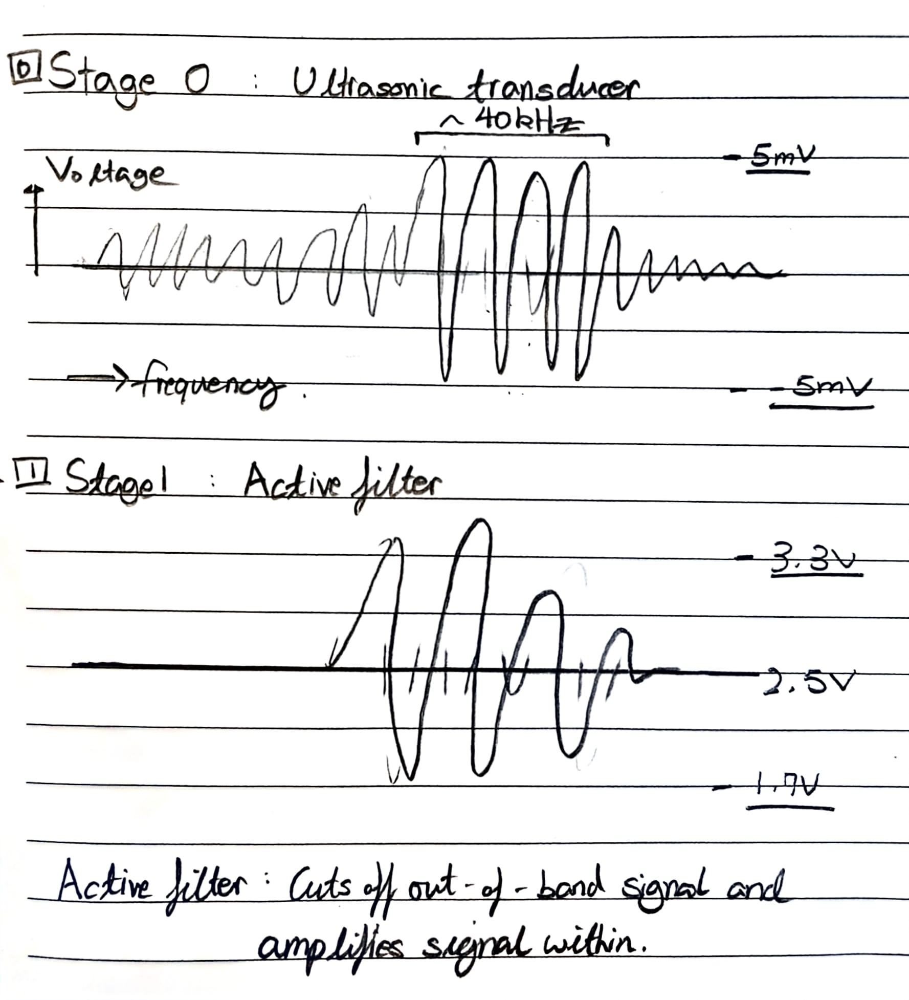

> Unmodified signal from the transducer would be an AC signal with weak amplitude.

—-------------------------------------------------------------------------------------------

This part of circuit is an \`Active Filter\` This is used to filter out the parts that are out of band and amplify the signal within the specified range of frequency. We should also set up a

bias point around 2.5V to avoid

clipping the -ve part of the signal.

—---------------------------------------------------------------------------------------------

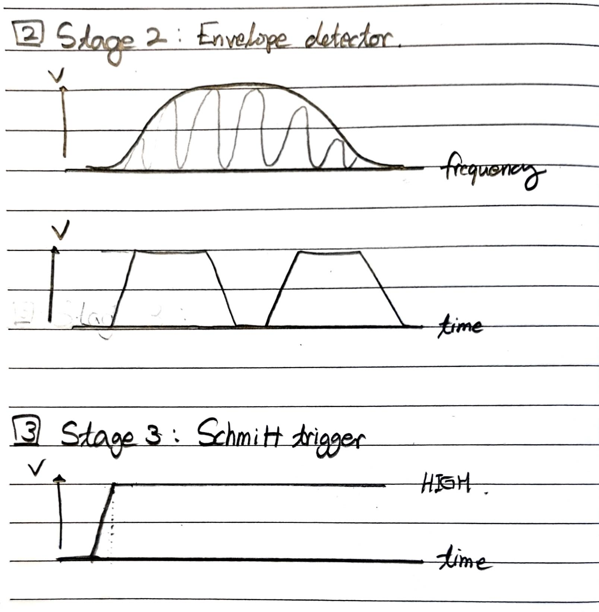

Envelope Detector is used to smoothen out the alternating signal.

—---------------------------------------------------------------------------------------------

> Schmitt Trigger converts those pulses into a clean digital signal. With a high voltage outlining the presence and 0V representing the absence.

**<u>Component Selection</u>**

1.  Ultrasonic Transducer. (Used for stage 0)

Write about MCP6022, mention that its frequency is centered around 40kHz. Why would that be good?

Also explain that you chose this because of : (See Below)

h component and maybe some conditions or any notes to take.

Critical Evaluation :

We can discuss the \`Gain-Bandwidth product\`.

> For example, if the MCP6022 has a GBPWP of 10MHz, show that at the target frequency of 40kHz the maximum achievable gain per stage before phase shift or distortion is :
>
> 10Mhz (GBWP of MCP6022)
>
> Max Gain = ——---—------------------------------ = 250.

40kHz (Target frequency)

If I run out of things to write, I can write why I chose a rail-to-rail amplifier.

2.  Opamp

MCP6022,

We can talk about the following:

- 

3.  Diode (1N4148)

This diode has a 0.7V voltage gap.

4.  Comparator(LM393P)

> This is good because : \~\~\~\~~

Discuss what each component can provide.

## Technical Implementation

**<u>Circuit Architecture</u>**

- **Pre-Amplification Stage**

- **Amplification**

- **Envelope Detector**

- **Comparator**

### **<u>0. Pre-amplification Stage</u>**

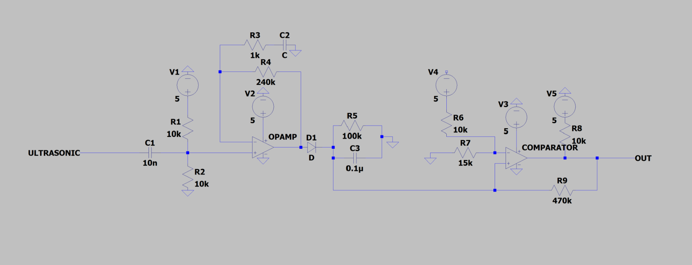

An AC signal is received by the ultrasonic transducer (MCP6022), which oscillates at around (10mV). Feeding the raw AC signal into an op-amp would clip the negative half of the waveform, since the output cannot swing below the negative rail.

(Insert a picture of the Signal output from the raw transducer. Taking picture from Oscilloscope, also use auto measure to show that peak-to-peak value is around 10mV)

An AC signal is received by the ultrasonic transducer (MCP6022), which oscillates at around (10mV). Feeding the raw AC signal into an op-amp would clip the negative half of the waveform, since the output cannot swing below the negative rail.

Therefore I had set up a bias reference point using a potential divider circuit using R1 and R2 both set to 10k(ohms), at 2.5V, so that the signal now oscillates around 2.5V.

An input decoupling capacitor is placed in series with the transducer to block out any external DC offset while passing the AC signal.

#### Testing - Stage 1\

### **<u>1 - Amplifier with frequency filterings</u>**

The environment around the rover contains acoustic sounds and noises from motors, surroundings etc. In order to analyse the ultrasonic signal, we would have to isolate the signal around 40kHz to only get the ultrasonic signal.

1)  Passive High band pass filter (C1 and R2)

\[Components in charge : C1, R1, R2\]

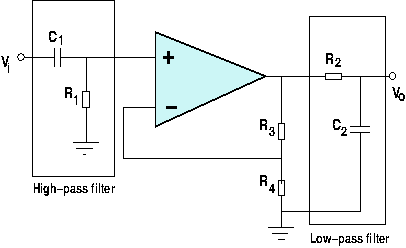

> C1 not only acts as an AC input decoupling capacitor but also as a high band pass filter along with the resistor placed (R1 \|\| R2).
>
> This filters out the low-frequency noise before we apply gain to the signal through the opamp.
>
> Cut-off frequency is : 3.2kHz
>
> Calculation is ⇒

2)  Opamp - gain of 241.

\[Components in charge : OPAMP, R3, R4, C2\]

> We would like to amplify the signal by 241 (240 + 1 \[original\]), I chose this value because it will amplify the voltage above a level where it can be used by comparator and also for low-pass filter.

Gain is calculated by this equation : (1 + R4(feedback) / R3) = 1 + 240 = 241.

3)  Low-pass filter. (From the opamp GBWP)

> We would need to cut out the signal above the specified frequency (around 42kHz). This is done by the roll-off frequency determined by the transducer’s gain and its GBWP(Gain-Bandwidth-Product).
>
> Roll-off frequency = GBWP/Gain
>
> = 10MHz / 241

~= 42kHz

> Therefore the opamp also acts as a low-band filter blocking out the signal above 42kHz.
>
> 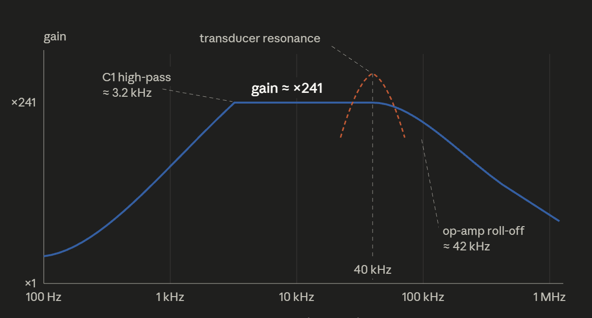
>
> Since the transducer picks up a signal centered at 40kHz, we will get a signal mostly consisting of a frequency around 40kHz.

**<u>Testing</u>**

### **<u>2. Envelope Detector</u>**

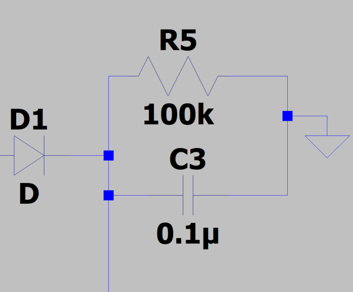

Problem : Pure signal from the previous stages outputs a high frequency AC signal.

We use the envelope detector which takes in high-frequency modulated signals and outputs its ‘envelope’ which is a smooth curve that outlines the peak of the original waveform.

Explain that a microcontroller cannot process a high frequency signal since it would require a massive amount of processing power for high-frequency sampling.

### **<u>3. Comparator Stage - Schmitt Trigger Hysteresis</u>**

Problem : Amplitude of the signal is not constant, it fluctuates very much depending on the distance from sensor to the rock.

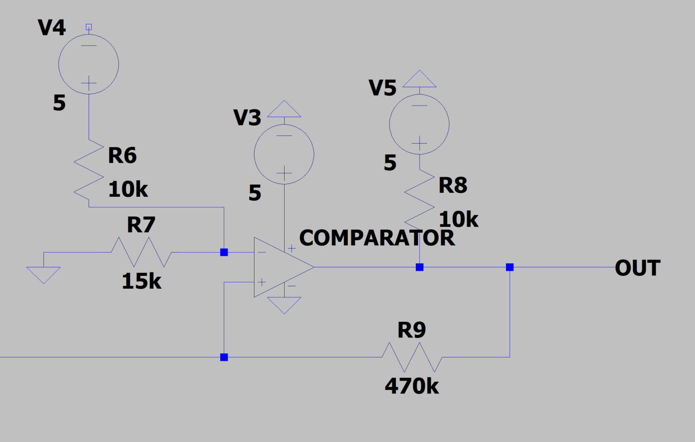

We convert the smoothed analogue signal from envelope stage into a digital \`High\` or \`Low\` logic signal that can be used to represent the presence of an ultrasonic signal. This is done by setting a reference voltage and when the signal crosses the threshold, the output snaps cleanly to a digital logic signal.

Explain about Schmitt trigger, and show the calculation for the upper threshold and lower threshold.

Also we can verify this using an oscilloscope and a power supply. By viewing how the output of a comparator changes as you change the input voltage.

## **<u>Evaluation of Ultrasonic Subsystem.</u>**

**<u>Verification of the circuit.</u>**

The circuit has been tested for each part of the circuit.

1)  

I can use the oscilloscope’s signal generator to verify that the circuit cuts out the frequencies below and above the set domain of frequency.

\[ Picture of the oscilloscope : Using signal generator in oscilloscope\]

\[ Multiple pictures of the oscilloscope showing the change in the signal\]

2)  Envelope Detector.

\[ Multiple pictures of the oscilloscope showing the change in the signal\]

3)  Comparator - Schmitt trigger

> \[ Picture of the signal in oscilloscope\]

As you can see from the photo above, output is a clean DC logic voltage. With 5V as HIGH and 0V as LOW.

This will be connected to a digital pin of an arduino and be used to detect a presence of signal.

\[ Multiple pictures of the oscilloscope showing the change in the signal\]

**<u>Others</u>**

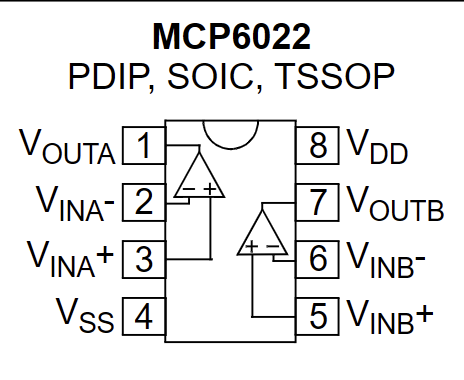

**Datasheet for MCP6022 : [<u>https://ww1.microchip.com/downloads/aemDocuments/documents/MSLD/ProductDocuments/DataSheets/MCP6021-Data-Sheet-DS20001685.pdf</u>](https://ww1.microchip.com/downloads/aemDocuments/documents/MSLD/ProductDocuments/DataSheets/MCP6021-Data-Sheet-DS20001685.pdf)**

**Datasheet for LM393P :**

[**<u>https://www.ti.com/lit/ds/symlink/lm2903b.pdf?ts=1780888870193</u>**](https://www.ti.com/lit/ds/symlink/lm2903b.pdf?ts=1780888870193)

**This is the circuit diagram of the ultrasonic subsystem.**

**INFRARED DETECTION (CHRIS)**

**<u>BACKGROUND</u>**

The types of a rock is indicated by an infrared signal pulse rate with a Poisson distribution, ultrasonic signal and magnetic fields. For infrared signal, you have already made a light sensor as part of the EEEBug and most silicon-based photosensors (such as the EEEBug phototransistor) are just as sensitive to infrared as visible light. You will need to measure the infrared pulses rate and this can be done with analogue or digital methods.

The optical power given by the rock is weaker than the light source you used for the EEEBug so you may need to amplify the output. Ambient light will cause interference and this can be filtered out by using a sensor that is only sensitive to the wavelength of the rock emission (950nm) and by using electronic filters. Many sources of electric light have a strong frequency component at 100Hz due to the rectification effect of the 50Hz AC source.

The infrared pulse rate is approximately λ=547 s-1 or λ=312 s-1 depending on the type of a rock. The pulse width of the infrared signal is just 50μs and the amplitude that you observe will be reduced if you filter out the high frequency harmonics. Low-pass filtering may smooth out the edges of the pulse and make pulse rate measurement less accurate. There can even be a problem with the sensor itself, since all optical sensors have a capacitance that acts to introduce a low-pass filter. There may be a trade-off between the speed and the sensitivity of your sensor.

A recommended method for measuring random infrared pulse rates on a lab oscilloscope is described below.

1.  View pulses on the oscilloscope with a 10ms timebase.

2.  Add measurement for 'Count' (positive or negative pulse depending on signal).

3.  Use the 'single' button to capture and count one screen of the signal. The oscilloscope shows 12 divisions at 10ms, so the measurement is the pulses counted in 120ms.

4.  You can confirm that the count measurement matches the number of pulses visible on the screen, but you should use the 'Zoom' view to be able to distinguish closely spaced pulses.

5.  Use the single button to make as many measurements as necessary to get a statistically significant result.

6.  Measuring the infrared pulses rate on the oscilloscope

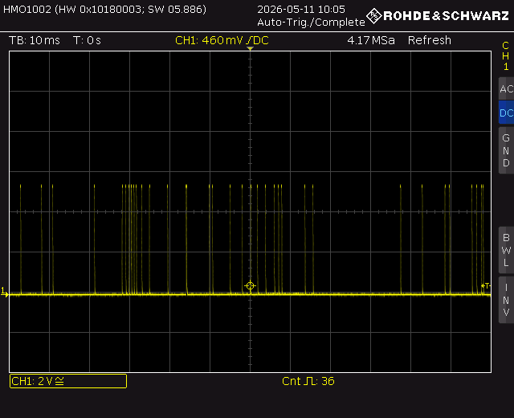

**<u>EEEBug Phototransistor</u>**

A phototransistor acts like a light-dependent current source. It requires a bias voltage to work and a load resistor in series to convert the current into a voltage that can be measured by the ADC. Additionally, a capacitor can be added to create a low-pass filter that will remove any high-frequency noise.

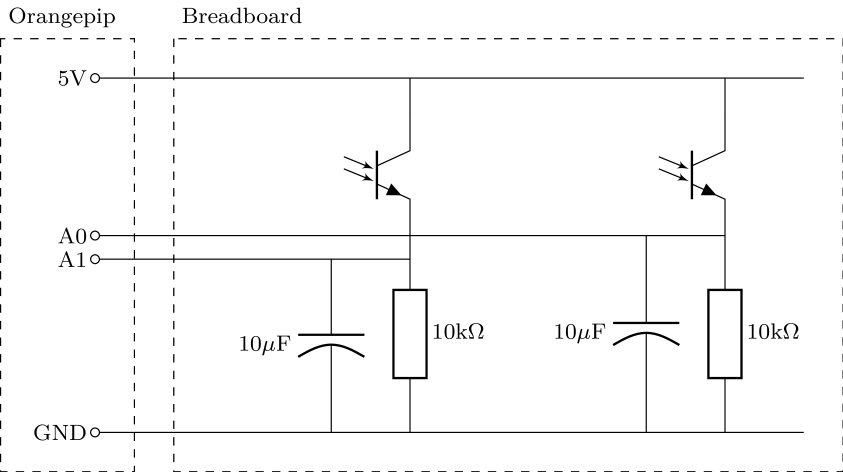

**<u>Design Log</u>**

**14/05**

Based on the background info + the EEE lab skills section on sensing, I ascertain that the key implement required to achieve infrared detection will involve a phototransistor.

The phototransistor acts as a light dependent current source. Since phototransistors are similarly sensitive to infrared radiation as they are to the visible light spectrum, they can be implemented here to detect IR. I theorise that I can implement a phototransistor that will send bursts of current to the metro board upon receiving IR, which can then be interpreted using proper arduino code to determine the frequency of the IR.

Some things to consider will be implementation of the filtering of ambient light, filtering of noise, while maintaining sensitivity and speed of the sensor.

<table style="width:96%;">
<colgroup>
<col style="width: 96%" />
</colgroup>
<thead>
<tr>
<th>Current train of thought for implementation</th>
</tr>
<tr>
<th>
Receive signal -&gt; filter for 950nm -&gt; amplify -&gt; filter noise -&gt; interpret -&gt;

return value
</th>
</tr>
</thead>
<tbody>
</tbody>
</table>

For now, the arduino code is superficial, I need to focus on how to implement the filtering and amplification for detection, before the interpretation stage. I realise there are two possible methods to achieve the detection:

1.  Optical Filter -\> amplify

- I can achieve this by attaching a physical filter to the phototransistor, using it to directly filter out light for wavelength 950nm.

- Then amplify using an opamp of some kind

> Advantages:

- Prevents unwanted light from generating current at all

<!-- -->

- Reduces saturation from ambient light

- Improves signal-to-noise ratio (SNR)

- Keeps the amplifier from amplifying unwanted signals

- Relatively simple implementation

2.  Amplify -\> electronic filter

Advantages

- Small signals become easier to process

- Active filters often require some gain anyway

Disadvantages:

- Noise and interference also get amplified

- Large unwanted signals can overload the amplifier before filtering

3.  Electronic filter -\> amplify

Advantages:

- Prevents out-of-band noise from entering the amplifier

- Reduces risk of overload/saturation

- Better dynamic range

Disadvantages:

- Passive filters may attenuate the desired signal too

- If the signal is already tiny, filter losses can hurt SNR

I note the demo conditions to determine what would be best. There is quite a lot of ambient light and the optical power given by the rock is weaker than the light source used for the sensing experiment (this was an iPhone torchlight). Hence, I determine that the best approach would be to combine method 1 and 2.

Combining method 1 and 2 would filter the IR in two stages. First, using the optical filter, unwanted ambient light will be filtered out from the 950nm wavelength we want to detect. Then, amplification so that the small signal is magnified for proper detection (electronic filtering first could result in loss of signal). Finally, electronic filtering using a band-pass filter to allow the desired frequencies of 312 and 547 to be “selected”.

**BREAK**

I noted that I was wrong in identifying what to measure to identify the rock types. The rocks emit IR using a poisson distribution, which is not equivalent to frequency. The pulse rates of 312 and 547 are not constant across the time they are measured for. [<u>https://www.youtube.com/watch?v=jmqZG6roVqU</u>](https://www.youtube.com/watch?v=jmqZG6roVqU) I watched this video to remind myself of the poisson distribution and relevant calculations. I will revisit this when determining how to interpret the signal data from the phototransistor.

I now determine what parts will be needed to start testing of my proposed detection method. I will need a phototransistor of course, followed by an opamp that can provide the gain and electronic filtering.

When deciding what type of phototransistor to use, I must pay attention to the spectral response, the speed and the viewing angle. [<u>https://www.wevolver.com/article/photo-transistor-comprehensive-guide-for-modern-engineers</u>](https://www.wevolver.com/article/photo-transistor-comprehensive-guide-for-modern-engineers)

<table style="width:96%;">
<colgroup>
<col style="width: 24%" />
<col style="width: 71%" />
</colgroup>
<thead>
<tr>
<th>Spectral Response</th>
<th>should be around 950nm (the wavelength of the IR from the rocks)</th>
</tr>
<tr>
<th>Speed</th>
<th>
should be greater than the signal bandwidth to prevent pulse smearing which will affect the calculation of lambda.

The pulse width of the IR pulses is related to the signal bandwidth. Pulse width (W) is the duration of a signal (t), while Bandwidth (BW) is the range of frequencies (Hz). For many applications, the bandwidth is the reciprocal of the pulse width: (BW =1/W).

The pulse width is 50microseconds which gives a bandwidth of 20kHz.
</th>
</tr>
<tr>
<th>Viewing angle</th>
<th>should be narrower to reduce noise that is picked up and enable a more directed detection method (benefit: start counting from earlier time when moving towards rock, improve lambda calculation. Con: must be pointed towards target)</th>
</tr>
</thead>
<tbody>
</tbody>
</table>

What is available in EEEstores:

| SD0127 | PHOTOTRANSISTOR 5mm,HALF ANGLE 50° | £0.35 |
|--------|------------------------------------|-------|

When deciding the type of opamp to use, I must pay attention to the gain-bandwidth product and the slew rate and the operating voltage.

<table style="width:96%;">
<colgroup>
<col style="width: 23%" />
<col style="width: 72%" />
</colgroup>
<thead>
<tr>
<th>GBP</th>
<th>Frequency at which gain becomes 1. Must make sure that the GBP of the chosen opamp is not at the detection frequency range otherwise will not be able to amplify the signal much for proper interpretation</th>
</tr>
<tr>
<th>Slew rate</th>
<th>
The slew rate of an operational amplifier is the maximum rate of change of its output voltage. This will limit the speed of amplification.

The pulsewidth is 50microseconds, which means that for optimised processing speed, the opamp slew rate must be equal to or higher than 50microseconds so it can respond quickly to the rise and falls in IR signal due to the short pulses.

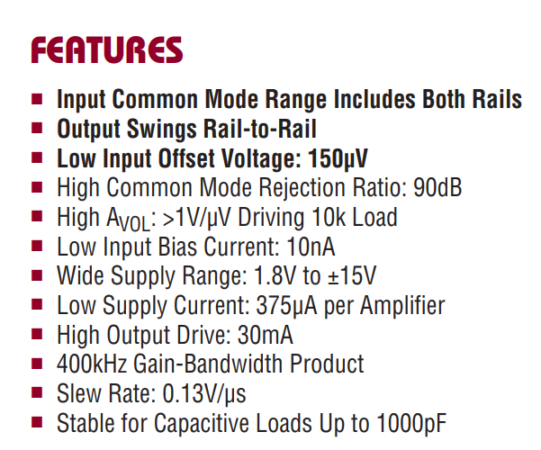

The LT1366 opamp has a slew rate of 0.13V/us which is very low and unideal for this detection
</th>
</tr>
<tr>
<th>Operating voltage</th>
<th>The voltage required to drive the opamp. The metro board has built in 5V and 3.3V regulators. The chosen opamp must be able to operate at either of these voltages or a combination of the two.</th>
</tr>
</thead>
<tbody>
</tbody>
</table>

**BREAK**

The last step of my research progress for today is to determine suitable candidates for the phototransistor and opamp parts to be ordered for testing next monday.

First, I determine pulse width, pulse rate and required timing accuracy. Then I choose a detector with sufficient bandwidth, then an amplifier bandwidth somewhat above detector bandwidth. Choose GBP from: required gain × required bandwidth

Using a 940nm peak wavelength phototransistor to detect a 950nm IR source is highly effective and widely considered a standard pairing. Because phototransistors have a broad spectral response, they maintain nearly full sensitivity within a few dozen nanometers of their peak. \[[<u>1</u>](https://uk.farnell.com/kingbright/l-53p3c/phototransistor-5mm-940nm/dp/2290444), [<u>2</u>](https://grobotronics.com/led-5mm-950nm-100mw.html?sl=en&srsltid=AfmBOorvawFirq3pNtxlpQzg2K08gzR1iaZQSdhpplrArb0X0NPYuHEL), [<u>3</u>](https://www.researchgate.net/publication/311624207_High-Performance_Near-Infrared_Phototransistor_Based_on_n-Type_Small-Molecular_Organic_Semiconductor), [<u>4</u>](https://botland.store/blog/phototransistor-what-is-it-and-what-is-it-used-for/)\]

Performance & Compatibility

- High Sensitivity: Most 940nm phototransistors are designed to be "spectrally matched" to emitters ranging from 870nm to 950nm.

- Minimal Efficiency Loss: While you aren't hitting the absolute peak (940nm), the drop in sensitivity at 950nm is typically negligible (often less than 5–10%), as the response curve for silicon-based sensors is relatively flat at these near-infrared wavelengths.

- Broad Bandwidth: A typical 940nm phototransistor can actually detect light across a massive range, often from 400nm to 1100nm. Manufacturers specify 940nm as the peak simply to indicate where it is most efficient. \[[<u>1</u>](https://uk.farnell.com/vishay/vemt3700f-gs08/photo-transistor-npn-940nm-plcc/dp/2504153), [<u>2</u>](https://www.futurlec.com/LED/INFD5940TRANS.shtml), [<u>3</u>](https://electronics.stackexchange.com/questions/478121/will-a-950-nm-ir-emitter-work-with-a-870-nm-phototransistor), [<u>4</u>](https://johnloomis.org/ece445/topics/egginc/pt_char.html), [<u>5</u>](https://uk.farnell.com/kingbright/l-53p3c/phototransistor-5mm-940nm/dp/2290444)\]

Practical Considerations

- Daylight Filters: Many 940nm phototransistors (like the [<u>Vishay VEMT3700F</u>](https://uk.farnell.com/vishay/vemt3700f-gs08/photo-transistor-npn-940nm-plcc/dp/2504153)) come with a "daylight blocking" black lens. This filter is specifically designed to allow IR light between 870nm and 950nm to pass while blocking visible light, making it ideal for your 950nm source.

I decided to end my research here. I will select a phototransistor with built in daylight blocking lens with appropriate remaining parameters and a corresponding opamp tomorrow

**15/05**

Continuing from my previous research, I began searching for an ideal phototransistor on Mouser. I found the following two transistors which could be ideal for detection.

| TEFT4300 | https://www.vishay.com/docs/81549/teft4300.pdf |
|----------|------------------------------------------------|
| BPV11F   | https://www.vishay.com/docs/81505/bpv11f.pdf   |

The TEFT4300 and the BPV11F are two transistors that are suitable for this application. Both have a black lens coating that filters out visible light so I can pinpoint the wavelength of IR to be measured. Both spectral wavelength ranges and rise and fall times are adequate for detecting the 950nm 50-microsecond-width pulses. The key difference is the viewing angle. TEFT4300 is 30 while the BPV11F is 15. The BPV11F smaller viewing angle can further minimise ambient noise and distortion. It might be worth it to purchase both and test both.

As for the opamp, I choose one based on GBP and slew rate. Slew rate should be at least 5V/us to be safe. As for GBP, I have to determine that based on the gain I want to implement for the signal detection. I will go into the lab and test the detection method with the existing phototransistor and LT1366 to see the pulses before determining the desired gain. A key concern is managing the circuit package size.

**BREAK**

I now move onto testing the infrared detection method as proposed in the github. I replicated the phototransistor sensor setup detailed in the sensor lab skills section like so:

I configured the arduino code to run on the metro board and then ran a simulation using my torchlight to confirm that the detector works as per normal. I then used the rock simulator to perform an IR detection test.

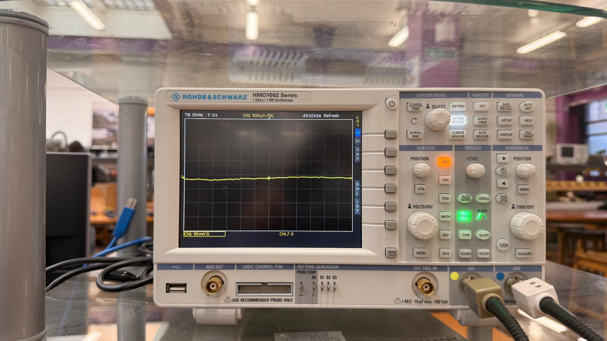

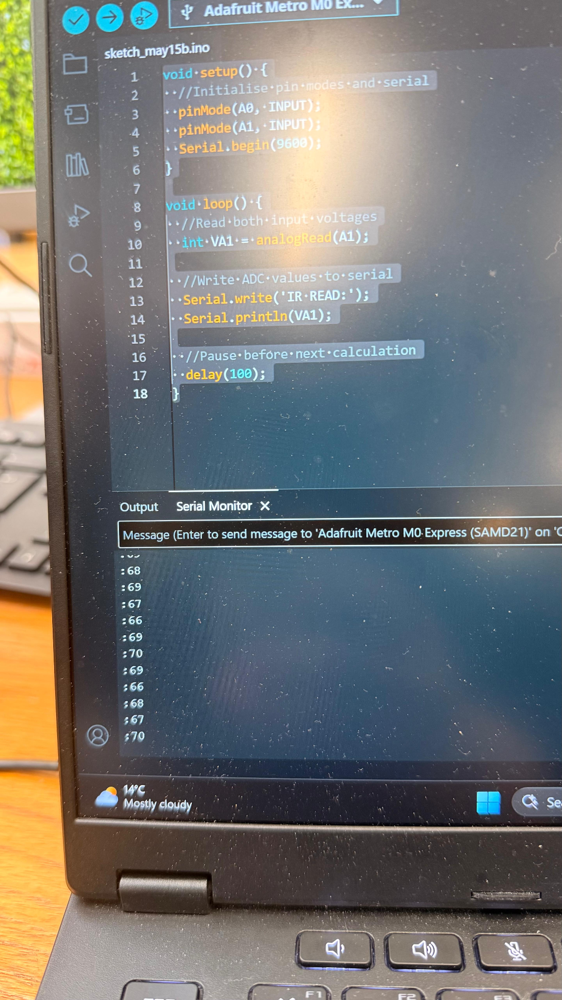

I couldn’t obtain any noticeable pulses on the oscilloscope or the serial monitor when testing with the rock simulator, even though the phototransistor was sensitive to light. I realised that the capacitor in parallel might be affecting the detection of pulses as capacitors act as filters. I then removed the capacitor and found that the pulses were now being detected as spikes on the oscilloscope and large value jumps on the serial monitor.

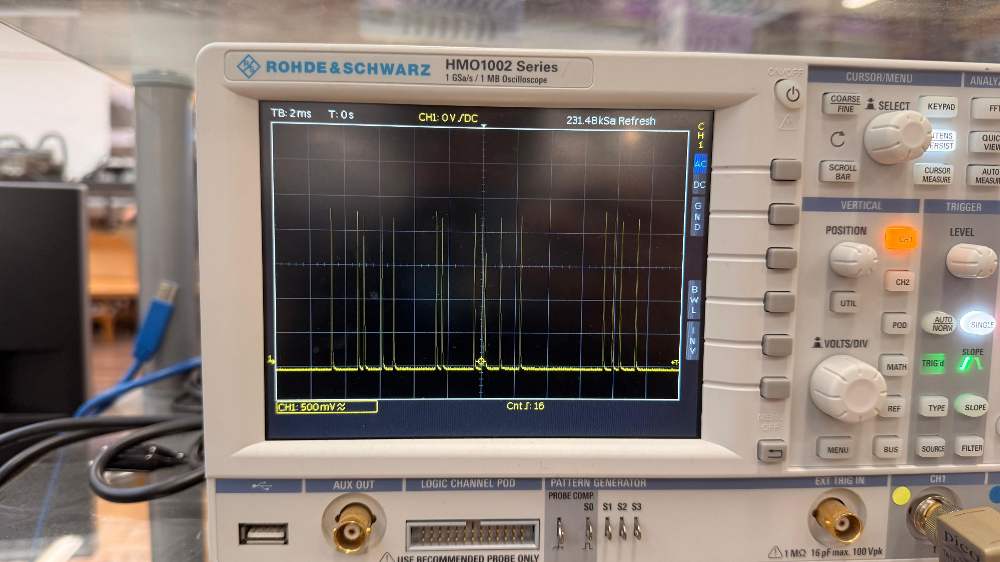

I note that the signal is detected when the diode points at roughly mid level to the internal PCB of the rock simulator. Upon covering the internal PCB with the rock case, I observed that the pulses had dropped significantly. I could only see very small pulses, as shown below:

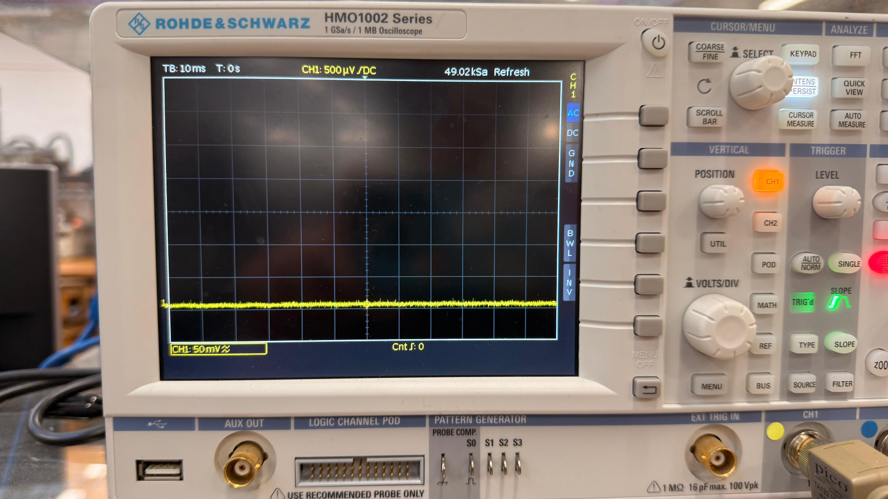

With this in mind, I believe a gain of 10-20 would be sufficient to amplify the signal back to a readable value.

After researching, the AD8032 is a suitable opamp for amplification use:

[<u>https://www.mouser.co.uk/datasheet/3/1014/1/AD8031_8032.pdf</u>](https://www.mouser.co.uk/datasheet/3/1014/1/AD8031_8032.pdf)

GBP is 80MHz, which when providing a gain of 20 results in a bandwidth of 4MHz, plenty of bandwidth to spare when the cutoff frequency of the detector diode is only around 110kHz. Gives leeway for higher magnitude gain if needed.

Slew rate is 30V/us which far exceeds the pulse width, will be able to respond quickly.

Can operate from 2.7 to 12V, suitable range as access to 3.3V and 5V voltage nodes.

Is also dual channel, can be used for amplification of other detection circuits so as to maximise breadboard space efficiency.

Changed to MCP6022I/P (explain why later)

**22/05**

All parts needed have arrived, proper design testing begins. First reconfigure test setup using new parts. Keep in mind digital pins 6,4,3,2 used for motor control

Bought TEFT and BPV to test and compare. First set up using TEFT

[<u>https://www.youtube.com/watch?v=zNAbcUSptWE</u>](https://www.youtube.com/watch?v=zNAbcUSptWE)

Determine the gain, start with a test of gain = 10, easiest choice of resistors is 10k and 100k -\> gain = 11 (non-inverting) INSERT PIC OF nodal analysis circuit drawing

Detection pre opamp successful using TEFT4300, insert pics, scale for V = 10V. Upon covering w rock, need to increase scale to 50mV to obtain visible pulse, large drop off due to rock interference

Implement opamp

Note, check original signal detection, why amplitude so high? If too high cannot be fed into opamp, would explain why opamp not working

Tab 2

# Albert Ma — Movement & UI Logbook

Personal work log for the Movement / Web UI module of the EEE Lunar Rover (Group 10).\
Maintained here as a draft; the contents are periodically copy-pasted into the team's Google Doc.

## Date: 13 May 2026

### 👥 Team Organization & Task Allocation

- First team meeting at the EE lab (10am, table near the demo area). Held an initial team introduction session.

- Defined and allocated project roles across the team:

  - Mohammed Salem + me: Arduino movement code + user interface

  - Devesh Kemani: Magnetism detection

  - Christopher Koh: Project Manager + Infrared detection

  - Wangmo Koo: Ultrasonic detection + Parts IC

  - Ye Zifan: Age detection

### 🛠️ Hardware & Assembly Progress

- Assembled the basic physical chassis of the EEE Lunar Rover.

- Initial motor diagnostic surfaced two issues:

  - One motor was running noticeably weaker than the other.

  - **Left motor was wired into the right motor's pin on the PCB** (swapped at the PCB level) — flagged for follow-up; later worked around in software (see the 18 May setMotor() HIGH/LOW swap).

- After bench fixes, confirmed the H-bridge driver and differential steering are functional.

### 💻 Software & Project Management

- Set up the team's **central GitHub repository** (Albert14736/EEELunarRover2526-main): created the base branch structure, defined the Sync files on GitHub/ workspace convention (so planning/progress files stay separated from individual code workspaces), wrote the root README, and added Chris, Mohammed, and Zifan as collaborators.

- Standardised the team's docs on **Markdown** so progress, instructions, and embedded screenshots can live alongside the code.

- Migrated existing project planning, schedules, and trackers from Notion into the repo so everything is in one version-controlled place.

- Briefly evaluated **VS Code Live Share** as a real-time collaboration option; team consensus was to stick with GitHub to keep the workflow simple.

### 🎮 Web UI & Movement Control (Major Milestone)

- Developed the complete C++ backend for WiFi remote control, including an automated **500 ms "Watchdog"** safety mechanism that auto-stops the rover if the network connection drops.

- Designed and implemented a responsive **"Hold-to-drive" Web UI** with a live command-history log for debugging. Deployed a temporary UI prototype via GitHub Pages for easy mobile access (this prototype was for backend adaptation/testing only — production UI is now served from the board itself, see 18 May).

- Surveyed the team on **"Tank-style" (rotate-on-the-spot) vs "Car-style" (turn-while-moving) steering**; team picked Tank-style and the C++ backend was implemented accordingly.

- Briefly discussed adding **joystick / analog control**; deferred — the Metro M0 has limited compute headroom (the course brief notes it can't run Python scripts), so we chose to stabilise the simple discrete-direction implementation first.

- Added quality-of-life UI features: per-second connection heartbeat with on-screen "Connected/Disconnected" indicator, 4 diagonal curve buttons (one wheel 200, other wheel 100), a scrollable command history block with an expandable full-screen view, and **WASD / arrow-key keyboard control** for desktop use.

- Wrote field test instructions (WiFi_Testing_Instructions.md) for the team to execute in the lab.

### 📅 Next Steps

- Next team meeting on the afternoon of 15 May to finalize sensor implementation strategies and integrate the frontend UI with the backend C++ motor control.

## Date: 15 May 2026

### 👥 Team Meeting (Hybrid)

- Second team meeting at the EE lab, 1pm. Devesh, Chris, and I attended in person; Mohammed joined remotely via Teams at 2:30pm.

- Agenda: share each member's individual research progress, discuss the overall rover plan, and rectify outstanding issues with the current build.

### 🌐 Networking Architecture Discussion

- Worked through how the rover receives signals over WiFi with Chris:

  - The EEERover network is a closed local-only WiFi — it has no internet access and only routes packets between devices connected to it. So it effectively acts as the intermediate "server" between the controller (phone / laptop) and the rover.

  - This means our existing implementation (HTTP requests from a browser on the same network) works without needing a separate backend server. If we ever wanted to control the rover from a device not on EEERover, we'd need to stand up our own server (e.g. run one on a laptop) as the intermediate.

  - Confirmed the static-IP setup: WiFi.config(IPAddress(192, 168, 0, groupNumber + 1)) with groupNumber = 10, giving the rover the stable address 192.168.0.11.

### 🛒 Procurement Discussion

- Discussed components for each sub-team's sensor implementation. Originally (per the 13 May plan) we had aimed to finalize the bill of materials today, but the team agreed more research was still needed on a few items, so the final BOM decision was **pushed to a follow-up online meeting** (later held on 18 May).

- Wangmo shared the supplier guidance (item name + item number, watch out for pack-of-10 quantities) so people could continue their parts research in the meantime; she would batch-order through the EEED website once the BOM is locked in.

- No new parts needed for the Movement / UI module, so nothing to submit from my side.

### 📡 Cross-team Status (for context)

- Zifan reported the antenna coil for age detection failed initial testing — the standard plastic-coated copper wire only measured ~5 µH on the LCR meter, too low. He proposed switching to proper enamelled magnet wire and asked whether parts can be sourced outside the EEEStore.

### 📋 Admin

- Filled in the participation form (deadline 18 May 7pm).

### 📅 Next Steps

- Reconvene online to finalize the BOM once everyone's parts research is in (later held on 18 May).

- In the meantime, continue working individually — fleshing out research, refining code, and updating personal progress logs for the eventual report.

## Date: 18 May 2026

### 🎮 Web UI & Movement Control

- Implemented the **autonomous Web UI** build — UI no longer depends on the GitHub Pages prototype; the full HTML/CSS/JS is now served directly from the Metro M0 via **PROGMEM** (keeps the page in flash to save SRAM).

- Restored the **advanced UI** features after the autonomous refactor: WASD / arrow-key control, command history log, connection-status indicator, and the sensor dashboard placeholder.

- Added a **cache-buster** (?t=\<timestamp\>) to every HTTP request. Without it, the browser was caching movement commands, so repeated taps on the same direction button were silently dropped.

### 🛠️ Hardware & Motor Control

- Shipped a **stable 5-way movement build** (Forward / Backward / Left / Right / Stop). Earlier builds were running out of SRAM and the WiFi stack would crash intermittently — PROGMEM fixed this.

- **Extended the build to full 8-way movement** later in the day — added the four diagonal directions (Forward-Left, Forward-Right, Backward-Left, Backward-Right) on top of the 5-way base. Inner wheel runs at 40% of the outer wheel speed for smoother diagonal turns. The Web UI's 3×3 directional grid now maps 1:1 to these 8 + Stop.

- Tuned **PWM scaling** so the motors respond proportionally to commands rather than running flat-out only.

- **Fixed the reversed forward/backward bug** by swapping the HIGH / LOW levels in setMotor(). Root cause: the motor wires are inverted relative to the H-bridge's expected polarity, so the software logic had to be inverted to match the actual wiring.

### 👥 Team Meeting (Online)

- Held the **follow-up online meeting** carried over from 15 May. Main agenda was finalizing the **bill of materials** — after the additional days of research, the team locked in which components need to be ordered (sensors, etc.). I'm not responsible for procurement myself, but attended to stay in the loop on what hardware the sensor sub-teams will be working with.

### 💻 Software & Project Management

- Synced **Devesh's magnetism detection** progress from his Google Doc into the repo under Tasks/Magnetism Detection/ so his hardware/code notes live alongside the rest of the project.

### 📅 Next Steps

- *(TODO: fill in any further team decisions if any)*

## Date: 22 May 2026

### 💻 Software & Tooling

- Built an automated **Google Docs sync pipeline** (sync-gdocs.sh at the repo root). One command: rclone pulls the team's master .docx from Drive's "Shared with me", pandoc converts it to GitHub-flavored Markdown, and embedded images are extracted into Sync files on GitHub/Group10_assets/media/. No more manual re-export.

- Added a project-root .gitignore to keep macOS .DS_Store files out of the repo.

- **Pushed two outstanding local commits** to GitHub that had been sitting unpushed since 18 May — including the backward-bug fix and the advanced Web UI restoration. The remote had been running an older buggy version until today.

### 🗂️ Project Management

- Investigated setting up a parallel **Notion sync** for the team's "Engineering Project Tracker". Blocked by Notion permissions — my account only has read access, which doesn't allow adding the Integration required for API access. To unblock, will follow up with Christopher (PM) to either grant Full access or temporarily publish-to-web for an audit.

### 📅 Next Steps

- *(TODO: fill in)*
