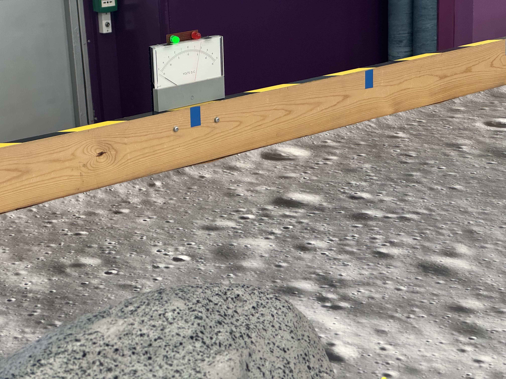

# ELEC40006 Electronics Design Project 
## Project Brief: EEELunarRover
	
## Introduction
	
The Electronics Design Project is one of the six modules that make up your first year of study.
It brings together theoretical and practical content from your lectures and labs with important industrial skills relating to product design, project management and team working.
		
You will work in tutorial groups of 6 people to complete the project.
It will be assessed with an interim interview, a final report that includes a professional reflection forms (must pass component), and a demo.
		
## Brief

You are requested to design a remotely-controlled lunar rover, EEELunarRover, that can survey the lunar surface and classify the rocks there.
Using a variety of electromagnetic signals, you must find out the age and types of each rock.

  
A prototype of the design must be built and tested in an artificial environment in the lab.
The quality of the design will be assessed against the following criteria:
- Is it possible to find the characteristics of all the rocks?
- Is the design cost and weight effective?
- Is the rover manoeuvrable enough to negotiate the environment?
- Is the construction robust and reliable?
- Is the remote control interface logical and easy to use?
	
## Characteristics of the rocks
### Age

The rocks transmits data via a radio using 89kHz carrier frequency, which is modulated with two-level *amplitude-shift keying* (on off modulation).
The age is encoded using ASCII character codes in UART packets with 1 start bit and 1 stop bit.
The data rate is 600 bits per second and each rock's age is four characters long, including an initial `#` symbol. If you receive `#123`, it will mean the rock's age is 1.23 billion. 
	

	
### Types

The rocks look same, but their colour and shape are superficial. You will need to examine other characteristics - infrared, ultrasonic and magnetic - to determine the types of a rock. The rocks emit radiation events randomly in time with a Poisson distribution which can be measured using an infrared detector on your rover. Infrared pulse rate will give information about the radioactivity levels of the rocks. Your rover will count the radiation event (infrared pulse rate) in the rocks to classify their radiactivity and type. Basaltoid and Lunarite are more radioactive than Gravion and Regolix. 

The characterisitics of each types are defined below:

| Types  | Infrared | Ultrasound | Magnetic |
| -------- | -------- | ----- | -------- |
| Basaltoid  |λ=547 s-1 | 40kHz      | Down     |
| Gravion  |  λ=312 s-1        |   | Down     |
| Regolix | λ=312 s-1  | 40kHz      | Up      |
| Lunarite |   λ=547 s-1       |  | Up    |

> [!NOTE]
> Please expect small deviations in the given values for Infrared pulse rate.

## Deliverables and assessments
	
The project will be assessed with an interim interview, a final report that includes a professional reflection forms (must pass component), and a demo with and interview and head-to-head competition.

### Interim Presentation

**Date of assessment:  28 May 2026**

The interim presentation is an opportunity to show your progress mid-way through the project.
You should prepare a presentation showing your high-level design, research and technical progress so far.
You should also present a plan for the remaining work to complete the project.

Marks weighting: 20%
	
### Report

**Date of submission:  11 June 2026**

The report is a formal documentation of all the technical and non-technical work you have done on the project.
The report should justify all your design decisions and include test results of various aspects of your prototype.
One team member should act as overall editor to ensure that the report is consistent in style and content.

Marks weighting: 40%

### Professional Reflection Form

**Date of assessment:  11 June 2026**

Professional Reflection Forms will be prepared individualy and added to your group project report appendix.

Marks weighting: 0% (must pass component)

			
### Demo

**Date of assessment:  16 June 2026**

The demo is your opportunity to present your completed project.
There are two parts to the demo:
1. An assessment of your rover on the lab bench, where your examiner will ask to see different functional aspects and assess your theoretical understanding of the implementation
2. A test of your rover on the demonstration arena, where multiple groups will compete to classify all the rocks in the quickest time.

Marks weighting: 40%
	
## Getting started
				
### EEEBug Expansion Kit
Your EEEBug has been designed to support modification for work on this project.
The Orangepip will be replaced with an ARM-based microcontroller platform with a WiFi module, but you can continue to develop code using the Arduino framework and IDE.
The central PCB has connections for a motor driver module, which will simplify the challenge of steering and reversing your rover.
			
### Sensing
You should use the outcome of your lab experiments to develop ideas for making sensors and analogue interfaces to detect the signals.
The EEEBug experiment showed you an example of an optical sensor.
The Passive Networks experiment (Autumn Term) introduces the concept of resonant circuits which, if the inductor is suitably constructed and orientated, will oscillate in the presence of radio waves of the correct frequency.
Magnetic sensors are not covered directly in the labs and you should carry out your own research in this area. Likewise ultrasonic transducers, which are usually designed to resonate at a specific frequency.
			
In certain cases you may wish to detect particular frequencies while blocking others, and you have explored to do this with passive and opamp-based circuits.
Some sensors will produce a weak signal that will need amplification.

Signals will need to be converted into the digital domain for transmission back to the rover operator.
Consider whether a binary input is sufficient, or you need to measure the voltage with more precision.
Research software libraries that can help you determine time-domain characteristics such as frequency or serial data encoding.
			
### Construction
Mechanical design is not a core component of the EEE/EIE degree so it is left to you to be innovative in the construction of your rover.
The EEEBug chassis is designed to be a useful platform but feel free to modify it, taking into account the budget and weight constraints.
			
You can download a computer-aided manufacturing (CAM) drawing of the chassis, which can be modified for reproduction in acrylic with a laser cutter.
Workshop facilities are available on arrangement with the lab technicians.
You may wish to consider 3D printing, though you will need to research and teach yourself the necessary techniques first.
3D printers are available to use with the help of the lab technicians.	

### Demo Environment
The demo environment has a grey coloured rubber flooring with some uncrossable obstacles.
Rocks will be distributed across the environment on the demo arena floor, spaced at least 500mm apart.
The arena is fitted with sensors in one area to check the weight of your rover. If your rover is heavier than 750grams, then it will fail classifying the rock in the weight sensitive zone on the lunar surface due to extremely loose and fragile surface there.

